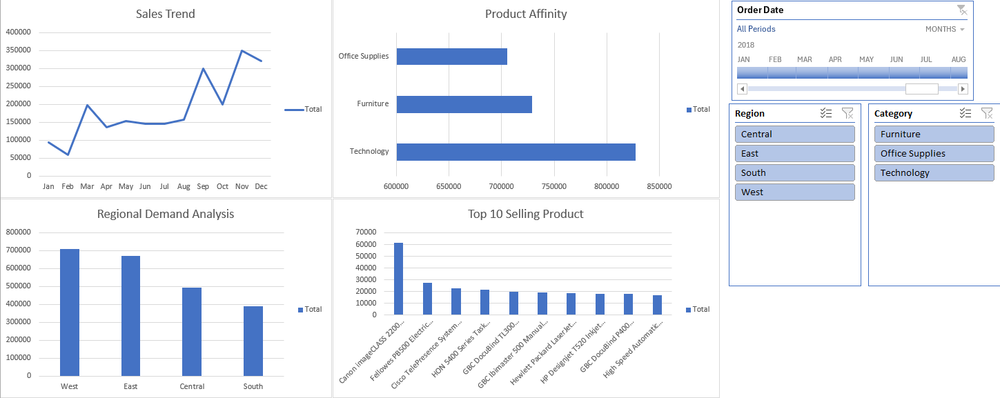

# Excel-Superstore-Sales-Analysis
Retail Sales Analysis using the Superstore Dataset

## Project Overview
This project analyzes retail sales data to identify key sales trends, product performance, and regional demand patterns.
Dataset used: Superstore Sales Dataset

## Dashboard Preview

## Project Objectives
- The goal of this analysis is to answer the following business questions:
- What are the sales trends over time?
- Which products generate the highest revenue?
- Which product categories perform best?
- How does sales performance vary across regions?

## Tool Used
Excel
- Data Cleaning: Handle date formatting errors (Order Date) and extract Year/Month , double check duplicate and fix missing value , text format ( Postal Code )
- Pivot Tables: Multidimensional Data Aggregation (Sales by Region, Category, and Trend).
- Dashboard Design: Use Slicers, Timelines, and various chart types (Line, Bar, Column).

## Key Insights
- Sales Trend: Sales grew strongly during the final months of the year (Q4).
- Top Product: Canon image CLASS products are the top-revenue-generating items.
- Region: The Western region is leading in sales.

## Business Recommendations
- Increase inventory for high-demand products.
- Optimize inventory allocation by region.
- Monitor low-profit product categories.
